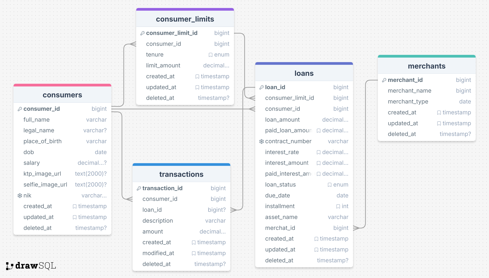

# XYZ Multifinance

## Overview
XYZ Multifinance is a financial application.

## Table of Contents
- [Routes](#routes)
- [Entity-Relationship Diagram (ERD)](#entity-relationship-diagram-erd)

## Routes
The application has the following routes:

### Consumers
- `GET /api/v1/consumers` - Retrieve all consumers
- `GET /api/v1/consumers/{id}` - Retrieve a specific consumer
- `POST /api/v1/consumers` - Create a new consumer
- `PUT /api/v1/consumers/{id}` - Update a consumer
- `DELETE /api/v1/consumers/{id}` - Delete a consumer
### Merhants
- `GET /api/v1/merchants` - Retrieve all merchants
- `GET /api/v1/merchants/{id}` - Retrieve a specific merchant
- `POST /api/v1/merchants` - Create a new merchant
- `PUT /api/v1/merchants/{id}` - Update a merchant
- `DELETE /api/v1/merchants/{id}` - Delete a merchant
### Consumer Limits
- `GET /api/v1/consumer-limits/{consumerId}` - Retrieve all consumer limits by consumer id
- `GET /api/v1/consumer-limits/{consumerId}/{tenure}` - Retrieve a specific consumer limit by consumer id and tenure
- `POST /api/v1/consumer-limits` - Create or Update consumer limit
- `DELETE /api/v1/consumer-limits/{id}` - Delete a consumer limit
### Loans
- `POST /api/v1/loans` - Create a new loan
- `GET /api/v1/loans/{id}` - Retrieve a specific loan
- `GET /api/v1/loans/consumer/{consumerId}` - Retrieve all loans by consumer id
- `DELETE /api/v1/loans/{id}` - Delete a loan
### Transactions
- `POST /api/v1/transactions` - Create a new transaction for loan payment
- `GET /api/v1/transactions/remaining-payment` - Retrieve remaining loan payment

## Entity-Relationship Diagram (ERD)
The ERD below illustrates the relationships between the entities in the XYZ Multifinance application:

